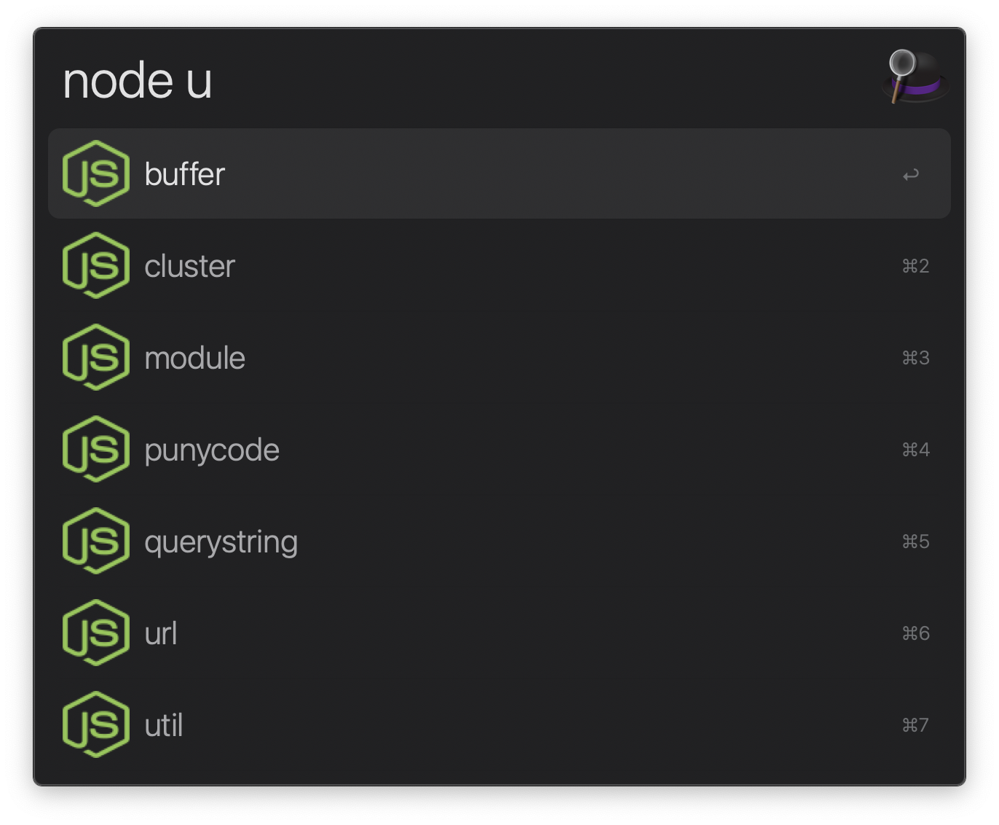

# alfred-node [](https://travis-ci.org/SamVerschueren/alfred-node)

> [Alfred 3](https://www.alfredapp.com) workflow to search for Node.js documentation




## Install

```
$ npm install -g alfred-node
```

*Requires [Node.js](https://nodejs.org) 4+ and the Alfred [Powerpack](https://www.alfredapp.com/powerpack/).*


## Usage

In Alfred, type `node`, <kbd>Enter</kbd>, and your query.

Select an item and press <kbd>Enter</kbd> to go to its [nodejs.org](https://nodejs.org) documentation.<br>
Press <kbd>Shift</kbd> to view the documentation in Quick Look.


## License

MIT © [Sam Verschueren](https://github.com/SamVerschueren)
